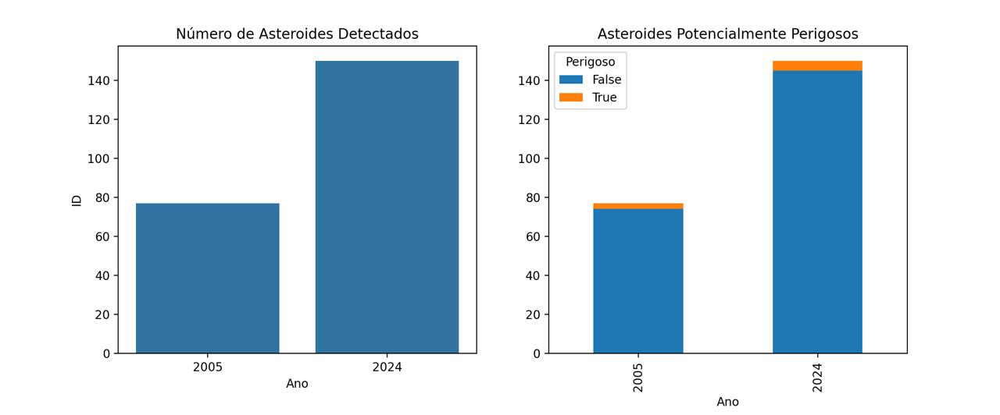
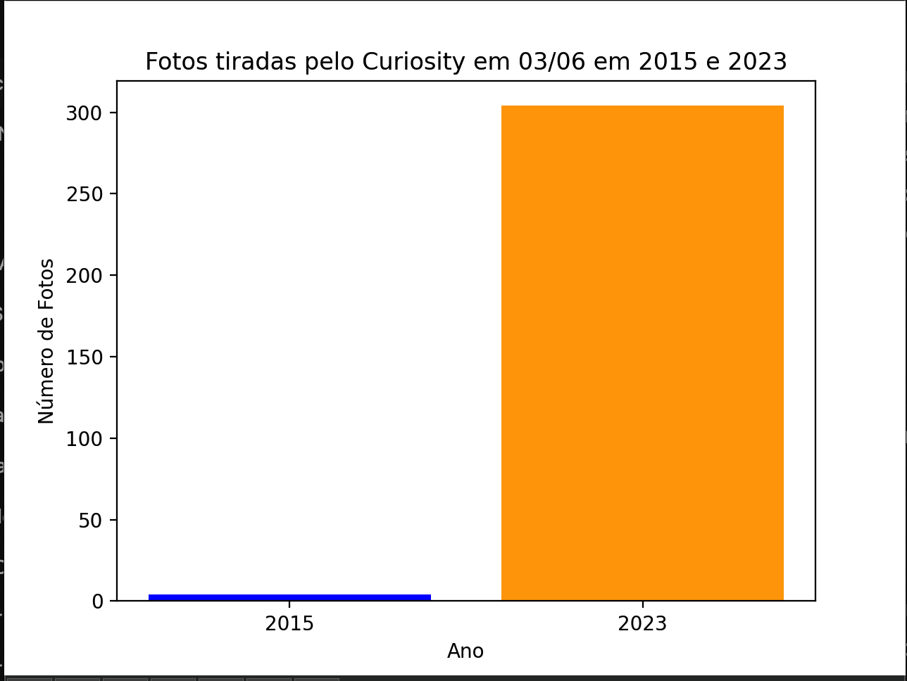
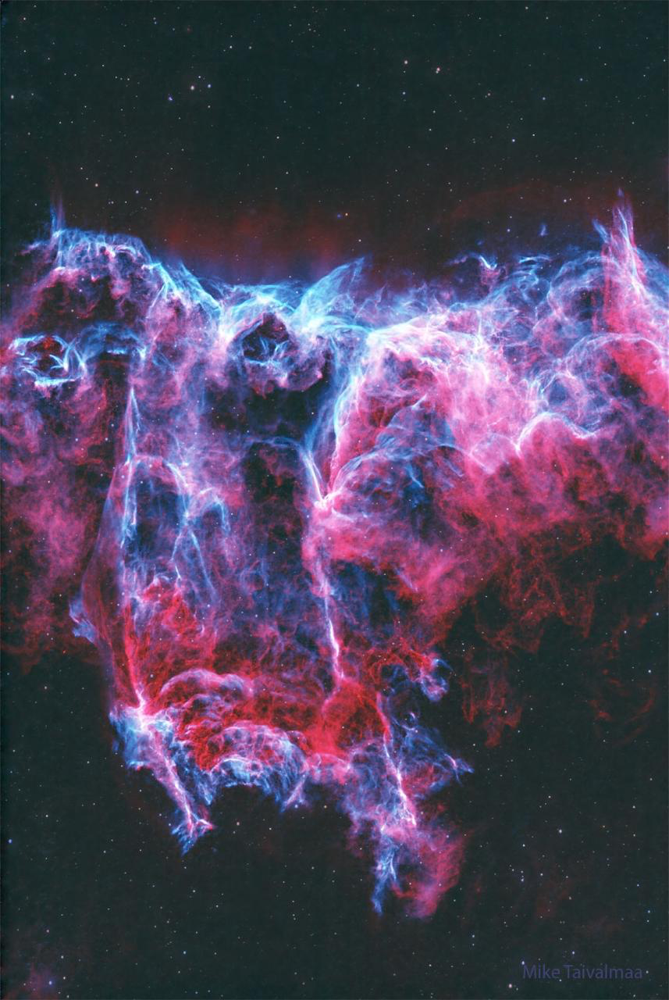
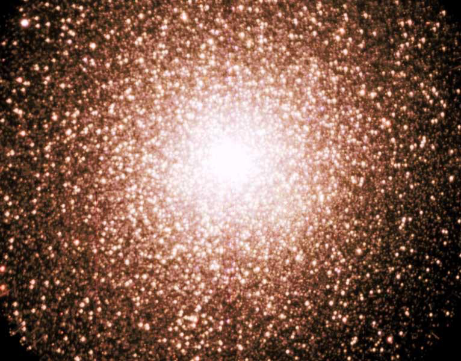

<h1 align="center">Extração de dados API NASA com Python</h1>

  <i>Este código utiliza Python e a API da NASA para realizar uma análise abrangente dos avanços tecnológicos na exploração espacial e suas demandas crescentes.</i>
    
  
    
  <b><a href="https://api.nasa.gov">Documentação API NASA</a></b> | <b><a href="https://github.com/Dante-Navaza2005">Meu perfil</a></b> | <b><a href="https://www.linkedin.com/in/dante-navaza/">LinkedIn</a></b>
    
  
  
  
    

**NOTA IMPORTANTE:** A chave API está contida em um documento separado e não está disponível no repositório. Por favor, utilize sua própria chave API, que pode ser gerada gratuitamente através do [link oficial da NASA:](https://api.nasa.gov).

  
<b>Tabela de conteudo</b>

* [Contexto e objetivo](#-Contexto-e-objetivo)
* [Tecnologias utilizadas](#-Tecnologias-utilizadas)
* [Features principais](#-features-principais)
* [Estrutura do projeto](#-Estrutura-do-projeto)
* [Getting started](#-Getting-started)
* [Additional changes](#-Additional-changes)
* [Thanks and contact](#-Thanks-and-contact)
* [License](#-License)

## 🌐 Contexto e objetivo

Nos últimos anos, o avanço tecnológico e o financiamento da NASA têm sido cruciais para descobertas científicas que moldam nosso entendimento do universo. Desde 2005, testemunhamos um aumento significativo na capacidade de explorar e documentar fenômenos astronômicos, como a descoberta de meteoros, imagens impressionantes de planetas e galáxias, e a exploração do nosso sistema solar. Esses progressos não apenas ampliam nosso conhecimento, mas também tem o potencial de garantir um futuro prospero para a humanidade.

O código apresentado neste notebook foi desenvolvido para coletar dados da NASA, permitindo a análise de asteroides, a visualização de imagens do dia (APOD) e a contagem de fotos tiradas pelo Mars Rover, comparando os avancos presentes entre os anos 2005 e 2024. Através de tecnologias como APIs da NASA, pandas para manipulação de dados e visualização gráfica com matplotlib e seaborn, conseguimos ilustrar as mudanças nas descobertas e na exploração espacial. Os resultados demonstram a evolução das informações desde 2005 até os dias atuais, destacando a importância do investimento contínuo em pesquisa espacial. À medida que avançamos, fica claro que, se continuarmos a focar nesse tema, as descobertas científicas essenciais para a humanidade apenas tendem a crescer.

Nosso objetivo é comparar a qualidade e a quantidade de dados coletados durante um período de sete dias em 2005 e em 2024. Essa análise permitirá descrever de forma precisa as mudanças e os avanços significativos que a exploração espacial experimentou nas últimas duas décadas. Vamos examinar os dados quantitativos, como o volume de informações obtidas, por meio de planilhas e gráficos. Além disso, avaliaremos os dados qualitativos, como a qualidade das imagens, obtendo os links das fotos para uma análise mais aprofundada.

## 🔧 Tecnologias utilizadas

* **APIs da NASA** : Utilizadas para coletar dados sobre asteroides, imagens do dia (APOD) e fotos do Mars Rover.
* **Pandas** : Biblioteca para manipulação e análise de dados, facilitando a organização e processamento das informações coletadas.
* **Matplotlib** : Ferramenta para visualização gráfica, utilizada para gerar gráficos representativos dos dados analisados.
* **Seaborn** : Biblioteca de visualização baseada em Matplotlib, que fornece gráficos estatísticos aprimorados e visualmente atraentes.
* **Requests** : Usada para fazer chamadas HTTP às APIs da NASA e obter dados em formato JSON.
* **Python** : Linguagem de programação utilizada para desenvolver o código, aproveitando suas bibliotecas para ciência de dados e análise de dados.

## 🎯 Features principais

* **Coleta de Dados de Asteroides** : Busca informações sobre asteroides próximos à Terra, incluindo nome, ID, diâmetro, velocidade e distância de passagem.
* **Busca de Imagens do Dia (APOD)** : Recupera imagens diárias da NASA com explicações, permitindo comparar conteúdos de diferentes anos.
* **Contagem de Fotos do Mars Rover** : Conta quantas fotos foram tiradas pelo Rover Curiosity em uma data específica, fornecendo insights sobre a exploração marciana.
* **Análise de Dados** : Combina e processa dados coletados, permitindo a visualização e interpretação das informações sobre asteroides e imagens.
* **Visualizações Gráficas** : Gera gráficos que mostram o número de asteroides detectados, a contagem de asteroides potencialmente perigosos e a comparação de entradas do APOD entre anos.
* **Interface Interativa** : Apresenta detalhes das imagens do dia de forma acessível e organizada, facilitando a compreensão dos dados.

## 🔧 Estrutura do projeto

* **Pasta image** (**Não** deletar): contém as imagens utilizadas neste README.
* **dados_asteroides_2005.csv e dados_asteroides_2024.csv**: arquivos que contêm diversas informações sobre asteroides dos anos 2005 e 2024, respectivamente, incluindo nome, diâmetro, velocidade e data de obtenção.
* **main.py**: arquivo principal em Python 3, que contém o código-fonte documentado.
* **main_jupyter.ipynb**: contém o mesmo conteúdo que o main.py, mas em formato Jupyter Notebook.
* **requirements.txt**: arquivo que lista todas as bibliotecas necessárias para instalação via pip.

## 🚀 Iniciando

Clone o repositorio:

`git clone Nasa-exoplanet-extraction`

Dentro da terminal do projeto, crie um ambiente virtual e instale as bibliotecas necessarias presentes no requirements.txt

`pip install requirements.txt`

Após isso, apenas rode o arquivo main.py ou o arquivo jupyter

Aqui está uma versão mais direta e concisa:

## 🛠️ Resultados e analise

### Analise meteoros

O código coleta dados sobre a detecção de meteoros próximos à Terra, organizando-os em tabelas para dois anos. Os resultados são apresentados em um gráfico que destaca os meteoros perigosos. Essa análise mostra um aumento de 70% nas detecções de meteoros nos últimos anos, como demonstrado nos gráficos gerados pelo codigo.

Os gráficos evidenciam o avanço da tecnologia de observação espacial nas últimas décadas, impulsionado por inovações rápidas e investimentos significativos. É importante notar que foram detectados meteoros potencialmente perigosos em ambos os anos, ressaltando a necessidade de monitorar esses eventos e como nossa capacidade de prevenção tem melhorado.

### Analise Mars Rover Curiosity

Utilizamos a API para obter fotos tiradas pelo Mars Rover Curiosity em Marte, com dados disponíveis de 2015 a 2023, focando em um único dia. O gráfico revela uma disparidade significativa no número de fotos registradas: em 2023, foram cerca de 300 fotos, enquanto em 2015, apenas 20. Essa diferença pode ser atribuída a vários fatores, como falhas na máquina ou falta de financiamento. No entanto, o mais provável é que seja resultado das melhorias tecnológicas atuais, que permitem capturar e armazenar muito mais imagens do que os modelos de rover de 2015.

## 🏆 Dificuldades e facilidades

Thank you for taking the time to read through my project. If you'd like to discuss this project further or have any questions, I'm open to connecting. Once more, feel free to reach out via email at dantenavaza2005@gmail.com or [LinkedIn](https://www.linkedin.com/in/dante-navaza/). If you're interested, you can explore my other projects on my [GitHub page](https://github.com/Dante-Navaza2005). I appreciate your interest and look forward to potential collaborations.

## 📄 License

This app is open-sourced software licensed under the [MIT license](https://github.com/Dante-Navaza2005/Airbnb-Rio-de-Janeiro/blob/main/LICENSE.txt).
